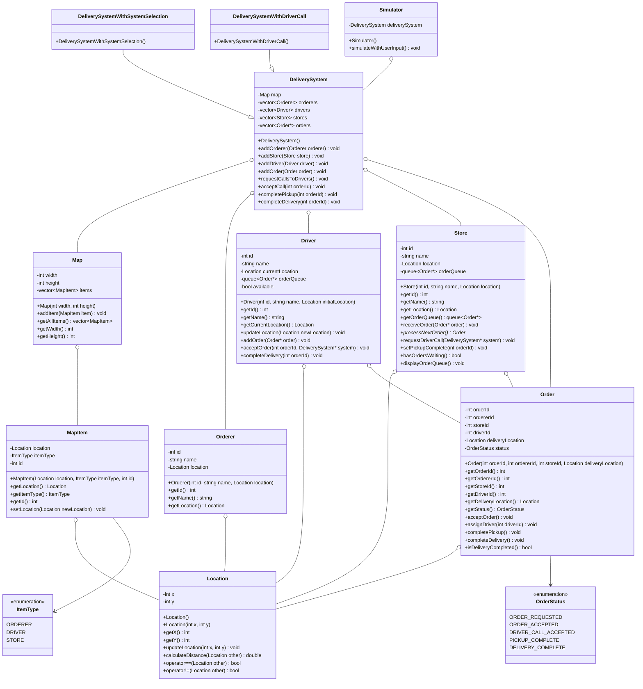

```mermaid
classDiagram
    class Location {
        -int x
        -int y
        +Location()
        +Location(int x, int y)
        +getX() int
        +getY() int
        +updateLocation(int x, int y) void
        +calculateDistance(Location other) double
        +operator==(Location other) bool
        +operator!=(Location other) bool
    }

    class Orderer {
        -int id
        -string name
        -Location location
        +Orderer(int id, string name, Location location)
        +getId() int
        +getName() string
        +getLocation() Location
    }

    class Store {
        -int id
        -string name
        -Location location
        -queue~Order*~ orderQueue
        +Store(int id, string name, Location location)
        +getId() int
        +getName() string
        +getLocation() Location
        +getOrderQueue() queue~Order*~
        +receiveOrder(Order* order) void
        +processNextOrder() Order*
        +requestDriverCall(DeliverySystem* system) void
        +setPickupComplete(int orderId) void
        +hasOrdersWaiting() bool
        +displayOrderQueue() void
    }

    class Driver {
        -int id
        -string name
        -Location currentLocation
        -queue~Order*~ orderQueue
        -bool available
        +Driver(int id, string name, Location initialLocation)
        +getId() int
        +getName() string
        +getCurrentLocation() Location
        +updateLocation(Location newLocation) void
        +addOrder(Order* order) void
        +acceptOrder(int orderId, DeliverySystem* system) void
        +completeDelivery(int orderId) void
    }

    class Order {
        -int orderId
        -int ordererId
        -int storeId
        -int driverId
        -Location deliveryLocation
        -OrderStatus status
        +Order(int orderId, int ordererId, int storeId, Location deliveryLocation)
        +getOrderId() int
        +getOrdererId() int
        +getStoreId() int
        +getDriverId() int
        +getDeliveryLocation() Location
        +getStatus() OrderStatus
        +acceptOrder() void
        +assignDriver(int driverId) void
        +completePickup() void
        +completeDelivery() void
        +isDeliveryCompleted() bool
    }

    class OrderStatus {
        <<enumeration>>
        ORDER_REQUESTED
        ORDER_ACCEPTED
        DRIVER_CALL_ACCEPTED
        PICKUP_COMPLETE
        DELIVERY_COMPLETE
    }

    class MapItem {
        -Location location
        -ItemType itemType
        -int id
        +MapItem(Location location, ItemType itemType, int id)
        +getLocation() Location
        +getItemType() ItemType
        +getId() int
        +setLocation(Location newLocation) void
    }

    class ItemType {
        <<enumeration>>
        ORDERER
        DRIVER
        STORE
    }

    class Map {
        -int width
        -int height
        -vector~MapItem~ items
        +Map(int width, int height)
        +addItem(MapItem item) void
        +getAllItems() vector~MapItem~
        +getWidth() int
        +getHeight() int
    }

    class DeliverySystem {
        -Map map
        -vector~Orderer~ orderers
        -vector~Driver~ drivers
        -vector~Store~ stores
        -vector~Order*~ orders
        +DeliverySystem()
        +addOrderer(Orderer orderer) void
        +addStore(Store store) void
        +addDriver(Driver driver) void
        +addOrder(Order order) void
        +requestCallsToDrivers() void
        +acceptCall(int orderId) void
        +completePickup(int orderId) void
        +completeDelivery(int orderId) void
    }

    class DeliverySystemWithSystemSelection {
        +DeliverySystemWithSystemSelection()
    }

    class DeliverySystemWithDriverCall {
        +DeliverySystemWithDriverCall()
    }

    class Simulator {
        -DeliverySystem deliverySystem
        +Simulator()
        +simulateWithUserInput() void
    }

    Orderer o-- Location
    Store o-- Location
    Driver o-- Location
    Order o-- Location
    Order --> OrderStatus
    MapItem o-- Location
    MapItem --> ItemType
    Map o-- MapItem
    Store o-- Order
    Driver o-- Order
    DeliverySystem o-- Map
    DeliverySystem o-- Orderer
    DeliverySystem o-- Driver
    DeliverySystem o-- Store
    DeliverySystem o-- Order
    DeliverySystemWithSystemSelection --|> DeliverySystem
    DeliverySystemWithDriverCall --|> DeliverySystem
    Simulator o-- DeliverySystem
```