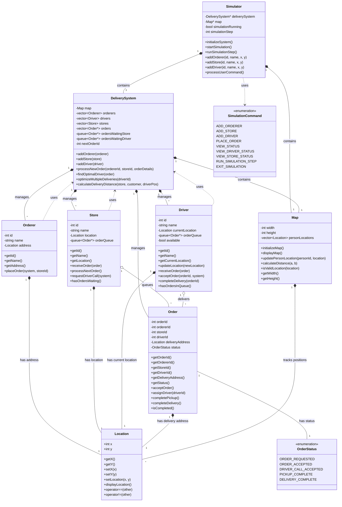

# 배달 시스템 클래스 다이어그램

## Mermaid 클래스 다이어그램

## 클래스 관계 설명

### 핵심 시스템 클래스
- **Simulator**: 전체 시뮬레이션을 관리하는 메인 클래스
- **DeliverySystem**: 배달 시스템의 핵심 로직을 담당하는 클래스

### 엔티티 클래스
- **Orderer**: 주문자를 나타내는 클래스
- **Store**: 상점을 나타내는 클래스
- **Driver**: 배달 기사를 나타내는 클래스
- **Order**: 주문을 나타내는 클래스

### 유틸리티 클래스
- **Location**: 2D 좌표를 나타내는 클래스
- **Map**: 지도 관리 및 거리 계산을 담당하는 클래스

### 열거형
- **OrderStatus**: 주문 상태를 나타내는 열거형
- **SimulationCommand**: 시뮬레이션 명령을 나타내는 열거형

### 주요 관계
1. **Composition (집합)**: Simulator는 DeliverySystem과 Map을 포함
2. **Aggregation (연관)**: Store와 Driver는 Order 큐를 가짐
3. **Association (연관)**: 각 엔티티는 Location을 가짐
4. **Dependency (의존)**: 엔티티들은 DeliverySystem을 사용